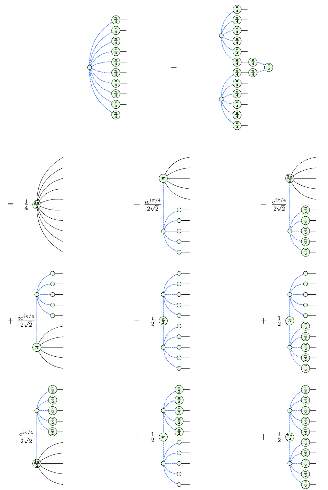

# Extending ZX Stabilizer Decomposition Techniques for Classical Simulation

Stabilizer decomposition has proven effective for classically simulating quantum circuits. 
In conjunction with libraries such as [QuiZX](https://github.com/zxcalc/quizx), users have the capabilities to simulate their own circuits on consumer hardware. 
We extend these capabilities with the addition of $\ket{\text{cat}_{10}}$ decompositions ($\alpha \approx 0.317$):

Read the [full report on Overleaf](https://www.overleaf.com/read/dhkmcdkjkkxp#6b1cd6).

## Dependencies

Rust 1.77.0+

## Quickstart

To reproduce our results, first build the `quizx` library via running the following from the root of this repo:

    cd quizx
    cargo build --release

The data itself is generated using the `hidden_shift_stabrank_cat10` binary. This takes several parameters as input, including a random seed, and produces a single row of CSV data (in its own file) as output. The easiest way to run these is by using the shell scripts found in the [scripts](scripts) folder. You can do so by running these commands from the root:

    cd scripts
    ./hidden_shift_data_cat10.sh
    
These take a long time to run, and benefit from having many cores available.

Once the data is generated, open the `scripts/visualize.ipynb` notebook to produce visualizations and data summaries.

For more details on the $\ket{\text{cat}_{10}}$ decomposition implementation, refer to `quizx/src/decompose.rs`.